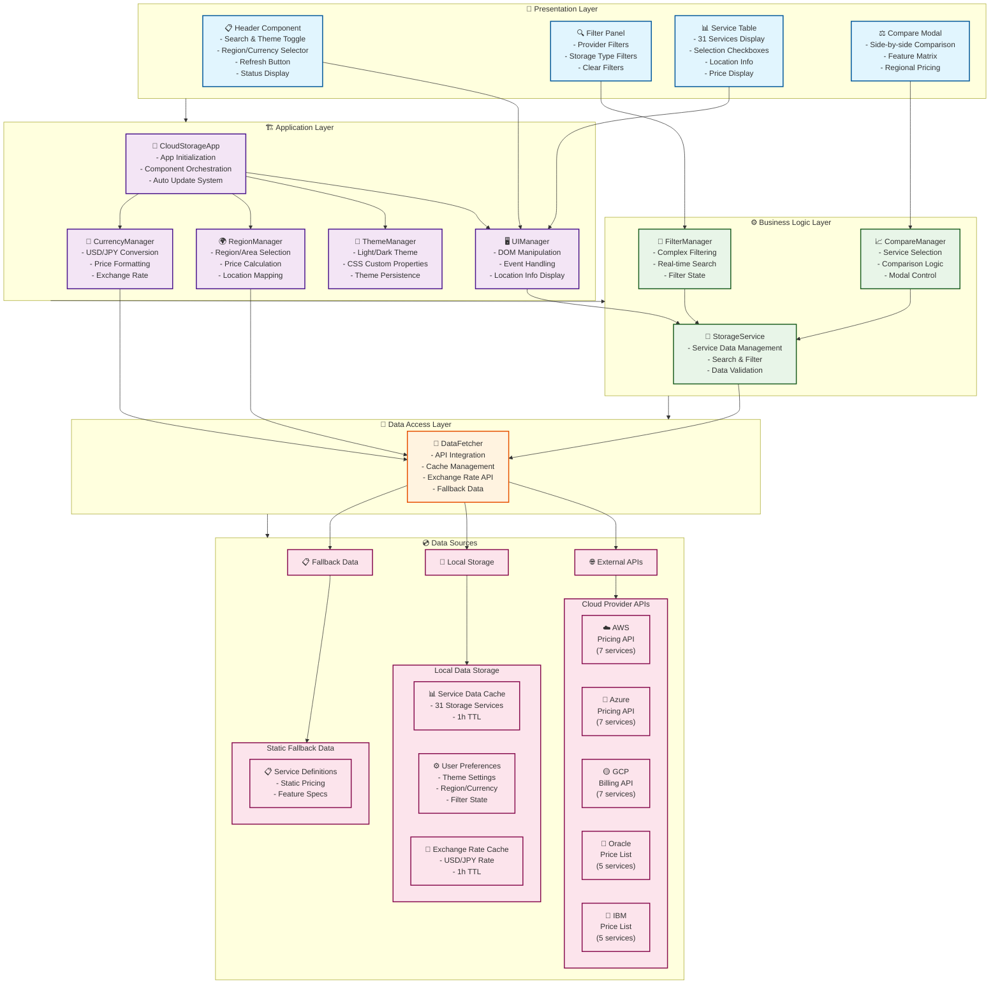
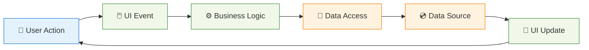
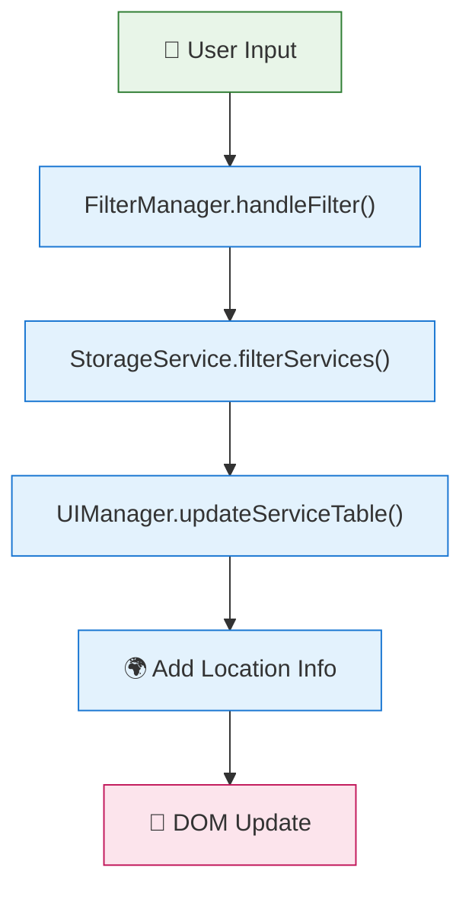
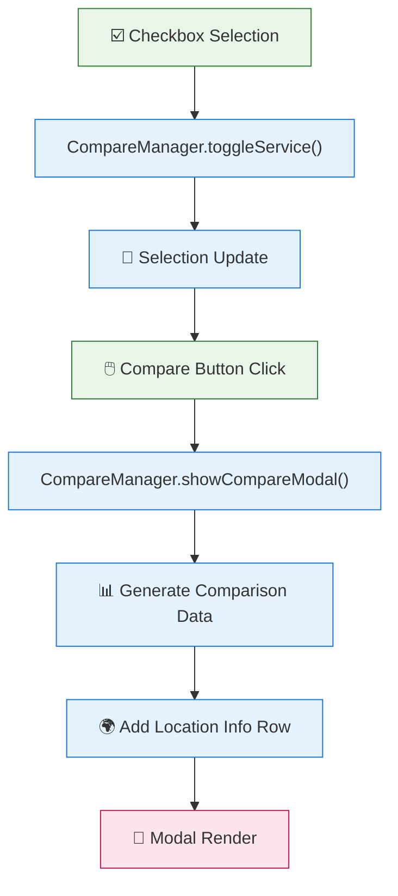
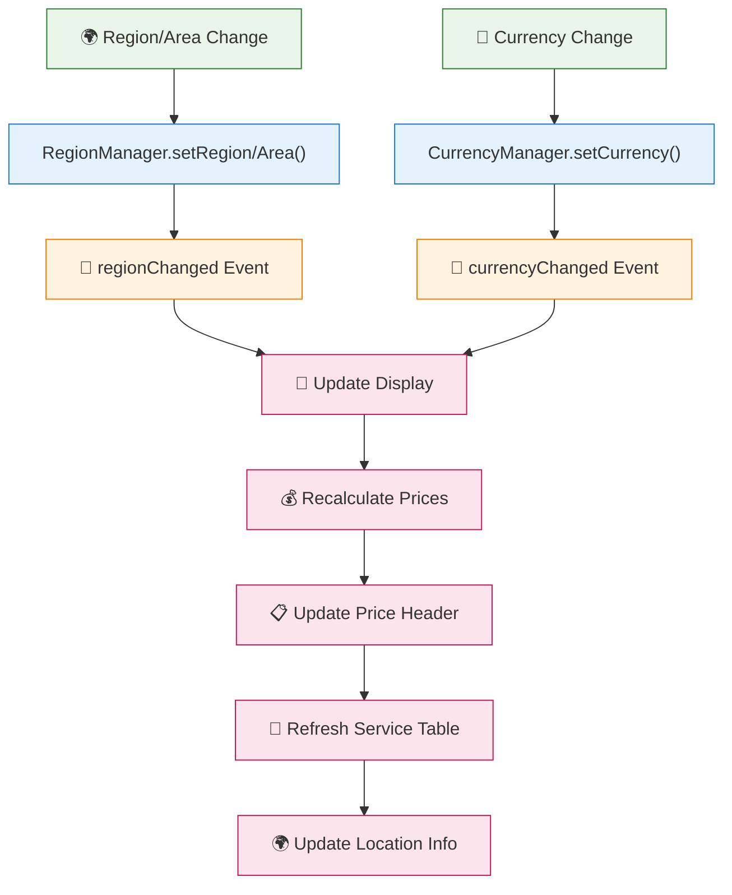
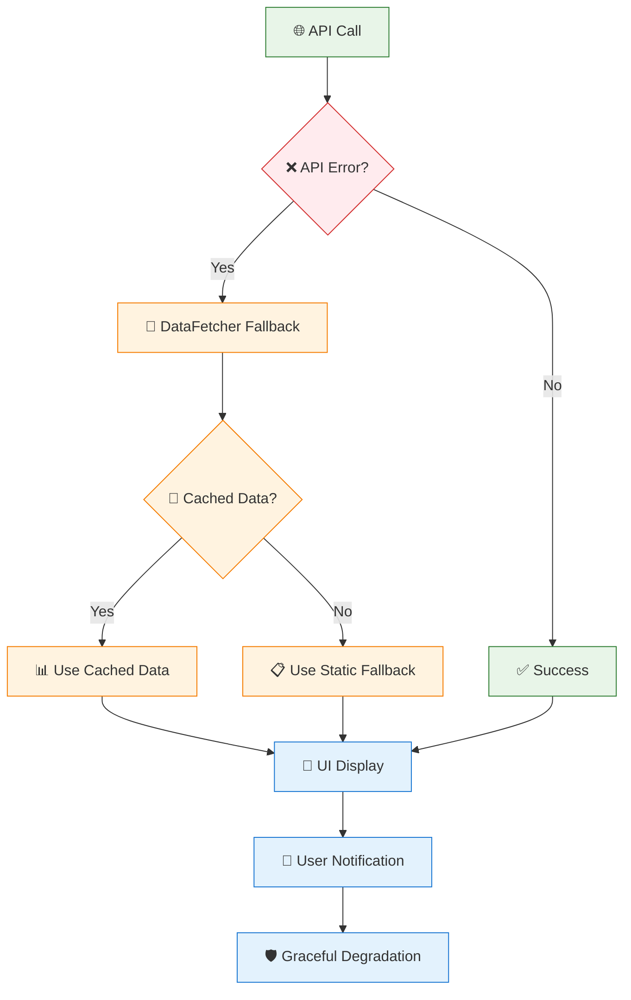

# クラウドストレージサービス比較アプリ 論理アーキテクチャ

## アーキテクチャ概要

本アプリケーションは、マルチクラウドストレージサービスの比較を行うクライアントサイドSPA（Single Page Application）として設計されています。

**最新バージョン**: v1.5.0 (2025-01-08)
- 31のストレージサービス完全対応
- 10リージョン・4地域での価格比較
- USD/JPY通貨切り替え
- ライト/ダークテーマ完全対応
- リアルタイム為替レート連携
- 地域・リージョン情報の詳細表示

## 論理アーキテクチャ図



## コンポーネント詳細

### 1. Presentation Layer（プレゼンテーション層）
**責務**: ユーザーインターフェースの表示と操作

- **Header Component**: 
  - 検索機能 (リアルタイム検索)
  - 表示モード切り替え (リージョン別/地域別)
  - リージョン・地域選択ドロップダウン
  - 通貨切り替え (USD/JPY)
  - テーマ切り替え (☀️ライト/🌙ダーク)
  - データ更新ボタン (🔄)
  - 最終更新時刻・為替レート表示
- **Filter Panel**: 
  - プロバイダ別フィルタ (AWS, Azure, GCP, Oracle, IBM)
  - ストレージタイプ別フィルタ (7タイプ)
  - フィルタクリア機能
- **Service Table**: 
  - 31サービスの一覧表示
  - チェックボックス選択機能
  - 全選択/部分選択対応
  - プロバイダバッジ・利用可能性表示
  - 地域・リージョン情報表示 (📍🗺️🌐)
  - リアルタイム価格表示
- **Compare Modal**: 
  - サイドバイサイド比較表示
  - 機能マトリックス
  - リージョン別価格・仕様詳細比較
  - 参照リージョン情報表示
  - 通貨別価格表示

### 2. Application Layer（アプリケーション層）
**責務**: アプリケーション全体の制御とUI管理

- **CloudStorageApp**: 
  - アプリケーション初期化
  - コンポーネント間の調整
  - 30分ごとの自動更新システム
  - エラーハンドリング
- **ThemeManager**: 
  - テーマ状態管理 (ライト/ダーク)
  - CSSカスタムプロパティ制御
  - ローカルストレージ連携
  - ラジオボタンイベント管理
- **RegionManager**: 
  - リージョン・地域選択管理
  - 地域別・リージョン別・全体平均価格計算
  - プロバイダー利用可能性チェック
  - 地域情報マッピング
- **CurrencyManager**: 
  - USD/JPY通貨切り替え
  - 価格フォーマット処理
  - リアルタイム為替レート管理
  - 通貨別表示最適化
- **UIManager**: 
  - DOM操作の抽象化
  - イベントハンドリング
  - 地域・リージョン情報表示
  - レスポンシブ対応

### 3. Business Logic Layer（ビジネスロジック層）
**責務**: アプリケーションの核となる機能の実装

- **StorageService**: 
  - 31サービスのデータ管理
  - サービス検索・取得
  - データ整合性保証
  - キャッシュ連携
- **FilterManager**: 
  - 複合フィルタリング
  - リアルタイム検索
  - フィルタ状態管理
  - 検索結果最適化
- **CompareManager**: 
  - マルチサービス選択管理
  - 比較ロジック実装
  - 比較結果生成
  - モーダル制御

### 4. Data Access Layer（データアクセス層）
**責務**: 外部データソースとの連携

- **DataFetcher**: 
  - 各プロバイダAPI対応準備
  - 1時間キャッシュシステム
  - リアルタイム為替レート取得
  - フォールバックデータ管理
  - データ検証・正規化
  - 並行データ取得

### 5. Data Sources（データソース）
**責務**: 実際のデータ提供

- **外部API** (対応準備済み):
  - AWS Pricing API
  - Azure Pricing API
  - Google Cloud Billing API
  - Oracle Cloud価格情報
  - IBM Cloud価格情報
- **ローカルストレージ**:
  - キャッシュされたサービスデータ
  - 最終更新タイムスタンプ
  - リアルタイム為替レート
  - ユーザー設定・選択状態
  - テーマ設定 (ライト/ダーク)
  - リージョン・地域・通貨設定

## データフロー

### 基本データフロー



### 主要データフロー

#### 1. アプリケーション初期化フロー

```mermaid
graph TD
    Start["🚀 App Start"] --> Init["CloudStorageApp.initialize()"]
    Init --> GetData["DataFetcher.getData()"]
    GetData --> CacheCheck{"💾 Cache Check"}
    
    CacheCheck -->|Valid| UIRender1["🎨 UI Render"]
    CacheCheck -->|Invalid| ExchangeRate["💱 Update Exchange Rate"]
    ExchangeRate --> LoadServices["📊 Load Base Services"]
    LoadServices --> UpdatePricing["💰 Update Pricing"]
    UpdatePricing --> CacheUpdate["💾 Cache Update"]
    CacheUpdate --> UIRender2["🎨 UI Render"]
    
    classDef start fill:#e8f5e8,stroke:#2e7d32
    classDef process fill:#e3f2fd,stroke:#1976d2
    classDef decision fill:#fff3e0,stroke:#f57c00
    classDef end fill:#fce4ec,stroke:#c2185b
    
    class Start start
    class Init,GetData,ExchangeRate,LoadServices,UpdatePricing,CacheUpdate process
    class CacheCheck decision
    class UIRender1,UIRender2 end
```

#### 2. フィルタリング・検索フロー



#### 3. サービス比較フロー



#### 4. リージョン・通貨変更フロー



#### 5. エラーハンドリングフロー



### データ同期パターン

- **キャッシュファースト**: ローカルキャッシュを優先、期限切れ時のみAPI呼び出し
- **フォールバック**: API失敗時の静的データ使用
- **並行取得**: 複数プロバイダからの同時データ取得
- **増分更新**: 変更されたデータのみUI更新
- **テーマ永続化**: ユーザーのテーマ選択をローカルストレージで保持

## 設計原則

### 1. 関心の分離（Separation of Concerns）
- **層別責務分離**: 各層が明確な責務を持つ
- **UIロジック分離**: プレゼンテーションとビジネスロジックの完全分離
- **データアクセス抽象化**: DataFetcherによる統一的なデータアクセス
- **状態管理分離**: 各マネージャーが独立した状態を管理

### 2. 単一責任原則（Single Responsibility Principle）
- **クラス単位**: 各クラスが単一の責務を持つ
- **機能分割**: フィルタ、比較、UI管理の独立
- **データ管理**: サービスデータとキャッシュの分離

### 3. 依存性の逆転（Dependency Inversion）
- **抽象依存**: 上位層が下位層の抽象に依存
- **インターフェース**: 疎結合な設計
- **注入パターン**: コンストラクタ注入による依存関係管理

### 4. 拡張性（Extensibility）
- **プロバイダ追加**: 新しいクラウドプロバイダの容易な追加
- **サービス拡張**: 新しいストレージサービスの簡単な追加
- **比較項目拡張**: 新しい比較項目の柔軟な追加
- **UI拡張**: 新しいフィルタやビューの追加が容易

### 5. パフォーマンス最適化
- **効率的キャッシュ**: 24時間キャッシュによる高速化
- **最小DOM操作**: 必要最小限のDOM更新
- **並行処理**: 複数プロバイダからの並行データ取得
- **遅延読み込み**: 必要時のみデータ取得

## 技術スタック

### フロントエンド技術
- **HTML5**: セマンティックマークアップ、アクセシビリティ対応
- **CSS3**: 
  - Flexbox、Grid、レスポンシブデザイン
  - カスタムプロパティ (テーマ管理)
  - CSSトランジション (スムーズアニメーション)
- **JavaScript (ES6+)**: モジュール、クラス、async/await、Fetch API

### アーキテクチャパターン
- **SPA**: Single Page Application
- **MVC風**: Model(Service) - View(UI) - Controller(Manager)
- **イベント駆動**: DOM イベントベースの相互作用

### データ管理
- **状態管理**: LocalStorage + In-Memory State
- **データ形式**: JSON (リージョン別価格構造)
- **キャッシュ戦略**: 1時間TTL、フォールバック対応
- **為替レート**: リアルタイム取得・キャッシュ
- **地域情報**: 4地域・10リージョンマッピング
- **テーマ設定**: ライト/ダーク永続化

### 通信・API
- **HTTP通信**: Fetch API
- **CORS対応**: プロキシ準備、フォールバック実装
- **エラーハンドリング**: Promise.allSettled による堅牢な処理

### UI/UX技術
- **テーマシステム**: ライト/ダークモード完全対応
- **地域・リージョン表示**: 視覚的アイコン (📍🗺️🌐)
- **通貨表示**: USD/JPY自動フォーマット
- **アニメーション**: CSSトランジションでのスムーズな切り替え
- **ユーザビリティ**: 直感的なドロップダウン・ラジオボタンUI
- **アクセシビリティ**: 適切なコントラスト比での読みやすさ
- **レスポンシブデザイン**: デスクトップ・タブレット・モバイル完全対応
- **視覚的フィードバック**: プロバイダー利用可能性インジケーター

### 通信・API技術
- **HTTP通信**: Fetch API
- **CORS対応**: プロキシ準備、フォールバック実装
- **エラーハンドリング**: Promise.allSettled による堅牢な処理
- **為替レートAPI**: リアルタイム取得・1時間キャッシュ
- **並行処理**: 複数プロバイダーからの同時データ取得

## セキュリティ・品質考慮事項

### セキュリティ対策
- **CORS制限対応**: ブラウザセキュリティ制限への適切な対応
- **XSS対策**: DOM操作時の適切なサニタイゼーション
- **データ検証**: 外部APIデータの検証・正規化
- **プライバシー保護**: 
  - ローカルストレージのみ使用
  - 外部への個人情報送信なし
  - クライアントサイド完結

### 品質保証
- **エラーハンドリング**: 包括的なエラー処理とフォールバック
- **データ整合性**: サービスデータの一貫性保証
- **パフォーマンス**: 効率的なデータ処理とUI更新
- **アクセシビリティ**: WAI-ARIA対応、キーボードナビゲーション

### 運用・保守性
- **ログ出力**: コンソールログによるデバッグ支援
- **設定管理**: 環境に依存しない設計
- **ドキュメント**: 包括的な技術文書・Mermaidチャート
- **テスタビリティ**: モジュール化による単体テスト容易性
- **バージョン管理**: 詳細なCHANGELOG・機能履歴
- **視覚的ドキュメント**: スクリーンショット・アーキテクチャ図